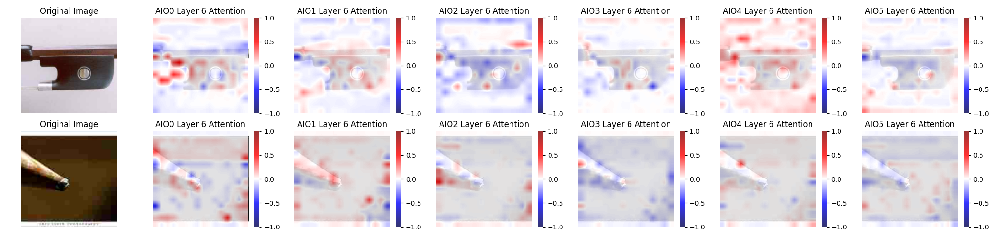

# Vision Transformer For Image Quality Prediction Of Individual Observers

### Description
This project presents individual image quality assessment using Vision Transformer (ViT). Building on previous research on predicting quality ratings of compressed images with CNN models, this work aims to develop a model for predicting image quality from individual observers using ViT. The model presented in the paper "[Vision Transformer for Small-Size Datasets](https://arxiv.org/abs/2112.13492)" has been integrated into this work for performance improvments on small-size datasets. In addition, visualization of the Vision Transformer's attention mechanism could provide better insight into the human visual system.

## Visuals


## Requirements
- Linux and Windows are supported, but I recommend Linux for performance and compatibility reasons.
- [Anaconda](https://www.anaconda.com/download), Miniconda or python-venv. To manage environment dependencies.
- NVIDIA GPU. I have done all testing and development using RTX 3090 GPU.
- 64-bit Python 3.11.4 and PyTorch 2.0.1 (or later). See [pytorch.org](https://pytorch.org) for PyTorch install instructions.
- CUDA toolkit 11.8 or later.

## Installation
```
git clone https://mygit.th-deg.de/mg06201/vision-transformer-for-image-quality-perception-of-individual-observers.git
cd vision-transformer-for-image-quality-perception-of-individual-observers
pip install -r requirements.txt
```

## Usage
Notebook for training
```
jupyter notebook ViT-IQA.ipynb
```
Notebook for evaluating
```
jupyter notebook ViT-IQA_eval.ipynb
```
## Download
The results and weights of all AIOs of the selected approach can be downloaded [here](https://nextcloud.th-deg.de/s/JokosT8agMc6icF).

## Support
For comments, questions and help I can be reached at the following email adress: max.geissler@stud.th-deg.de

## ToDo's
- [ ] Integrate pretrained ViT-Model (Probably not possible due to custom implementation / architecture)
- [ ] Compare Attention-Scores of ViT with GRADCAM of JPEGResNet50

***
- [x] Train ViT on idividuals (iterativ)
- [x] Train ViT on idividuals
- [x] Train ViT on all distored images
- [x] Write Training Script
- [x] Convert Matlab rating playlists to csv
- [x] Visualize Confusion-Map
- [x] Visualize dataset distribution
- [x] Visualize training results
- [x] Visualize Attention-Scores


## Acknowledgment
My appreciation goes to
- Marcus Barkowsky, my dedicated professor and mentor.
- Lohic Fotio Tiotsop, for his tips on visualising the attentionmaps.
- Pavel Majer, whose preliminary work made individual datasets available.
- [lucidrains](https://github.com/lucidrains), for his implementation of the Vision Transformer for small datasets.
